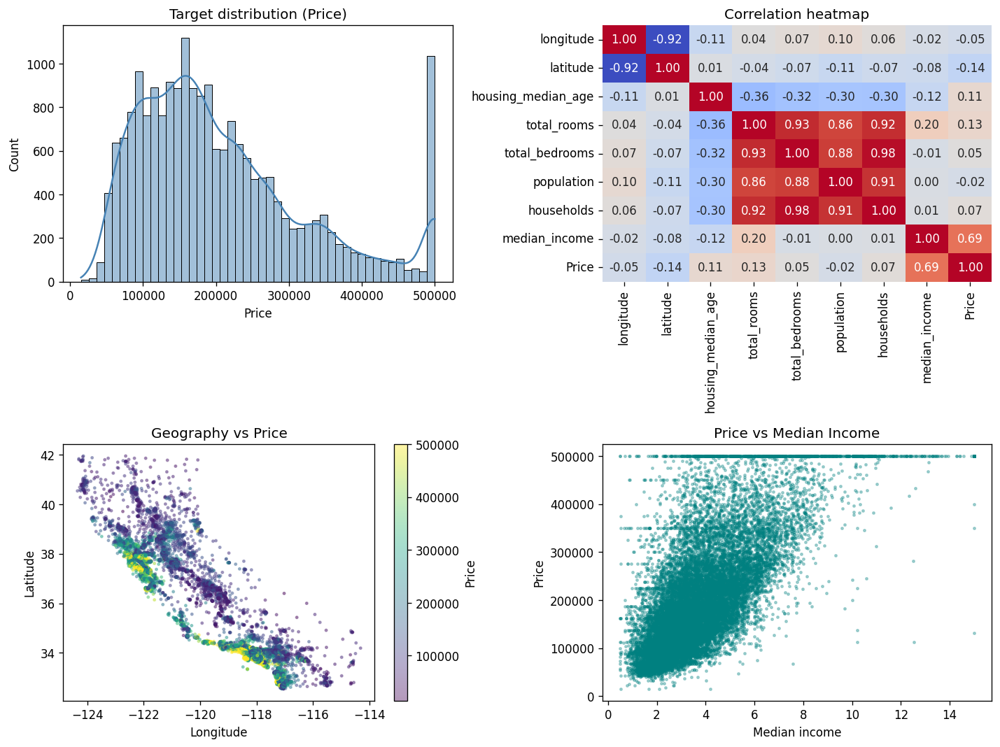
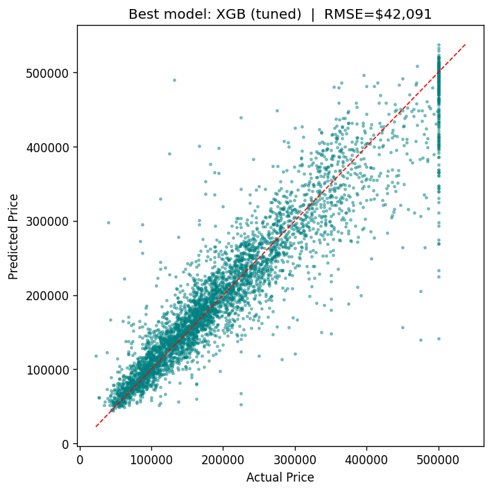

# 🏠 House Price Predictor — California Housing

End-to-end regression project. Predicts median house value from features like
income, location, and household composition.

Built as a learning project: covers EDA, missing-value handling, feature
engineering, regression, hyperparameter tuning, model ensembling, and honest
test-set evaluation.



## What it does

1. Loads the **California Housing** dataset (20,640 rows, 10 raw features
   + a categorical `ocean_proximity`).
2. **EDA** — distributions, correlations, geographic scatter, price by
   `ocean_proximity`.
3. **Cleans** — median-imputes the 207 missing `total_bedrooms` rows, drops
   duplicates, flags the well-known $500k price cap.
4. **Engineers 13 new features**:
   - per-household ratios (`RoomsPerHousehold`, `BedroomsPerHousehold`, …)
   - log-transforms for skewed block-level counts
   - `AgeSquared` (non-linear age effect)
   - distance to LA, distance to SF, distance-to-coast
   - KMeans `GeoCluster` (k=10) on lat/lon
   - ordinal `CoastOrdinal` derived from `ocean_proximity`
5. **Trains 6 model families** through a 5-fold CV harness:
   Linear, Ridge, Lasso, RandomForest, GradientBoosting, XGBoost.
6. **Tunes** XGBoost with `RandomizedSearchCV` (15 iterations).
7. **Stacks** Ridge + RF + GBR + XGB with a Ridge meta-learner
   (the "Top 4% on Leaderboard" trick from the Kaggle reference).
8. **Reports** RMSE, MAE, and R² on a held-out test set.
9. **Ranks features** with permutation importance.
10. **Saves** the best model (`joblib`) and CSV leaderboards under `artifacts/`.

## Results (held-out 20% test set)

| Rank | Model                |  Test RMSE |  Test MAE |  Test R² |
|-----:|----------------------|-----------:|----------:|---------:|
| 1    | XGBoost (tuned)      | **$42,091** |  $26,946 |  0.868 |
| 2    | XGBoost (default)    |   $42,841 |  $27,529 |  0.863 |
| 3    | Stacked ensemble     |   $42,867 |  $27,606 |  0.863 |
| 4    | Gradient Boosting    |   $44,911 |  $29,529 |  0.849 |
| 5    | Random Forest        |   $46,922 |  $30,560 |  0.836 |
| 6    | Ridge / Lasso / Linear | $64,115 |  $46,280 |  0.693 |

**Takeaways:**
- Trees crush linear here — the relationship is full of interactions and
  non-linearities, plus linear models can't represent the price cap at $500k.
- Tuned XGB beat the stack ensemble. Stacking helps when base learners are
  diverse and no single one dominates; here XGB eats the others, so the
  meta-learner has little new signal to extract.

## Top features (permutation importance)

| Feature                  | Importance (≈ Δ RMSE) |
|--------------------------|----------------------:|
| `latitude`               |  $54,859 |
| `longitude`              |  $35,849 |
| `median_income`          |  $34,854 |
| `DistSF`                 |  $18,790 |
| `DistCoast`              |  $16,006 |
| `PopulationPerHousehold` |  $15,056 |
| `CoastOrdinal`           |   $9,843 |

Location, income, location. Exactly what you'd expect for California.



## Run it

```bash
# 1. Install deps
pip install -r requirements.txt

# 2. (Optional) drop the dataset CSV next to the script
#    If `housing.csv` is missing the script falls back to
#    sklearn.datasets.fetch_california_housing
curl -L -o housing.csv \
  https://raw.githubusercontent.com/ageron/handson-ml2/master/datasets/housing/housing.csv

# 3. Run
python house_price_predictor.py
```

Outputs land in `artifacts/`:
- `leaderboard.csv`        — all model metrics
- `feature_importance.csv` — permutation importance table
- `best_model.joblib`      — serialized tuned XGBoost pipeline
- `pred_vs_actual.png`     — diagnostic scatter

Runtime: ~12–15 min on a single core, mostly the stacking step.

## 🚀 Deploy the interactive app

A Streamlit app (`app.py`) ships with the repo. It loads the saved model and
lets anyone adjust features on the left to get a real-time price prediction.

**Run locally:**

```bash
streamlit run app.py
# opens http://localhost:8501
```

**Deploy to share.streamlit.io (free, ~2 min):**

1. Push this repo to GitHub (if you haven't already)
2. Go to **https://share.streamlit.io** and sign in with GitHub
3. Click **"New app"**
4. Fill in:
   - **Repository**: `<your-username>/house-price-predictor`
   - **Branch**: `main`
   - **Main file path**: `app.py`
5. Click **Deploy** — first build takes ~1 min, then you get a permanent
   public URL like `https://<username>-house-price-predictor.streamlit.app`
6. The app needs `artifacts/full_pipeline.joblib` and
   `artifacts/leaderboard.csv` to run. The repo already includes them, so
   no extra steps needed.

**Free hosting caveats:** the Streamlit Community tier sleeps the app after
inactivity and may take 30s to wake up on a cold load. Fine for a portfolio
piece; upgrade if you need always-on.

## 🌐 Static landing page

A self-contained `site/index.html` (single file, no build step) showcases
the results. Deploy with any static host: Vercel, Netlify, GitHub Pages,
or `python -m http.server` to preview locally.

```bash
cd site && python -m http.server 8000
# open http://localhost:8000
```

## Project layout

```
.
├── house_price_predictor.py   # training pipeline
├── make_app_artifacts.py      # builds full_pipeline.joblib for the app
├── app.py                     # Streamlit app (interactive predictions)
├── build_site.py              # builds the static landing page
├── housing.csv                # California Housing (raw, Géron)
├── eda_overview.png           # EDA plot
├── site/index.html            # self-contained static landing page
├── requirements.txt
├── LICENSE
├── README.md
└── artifacts/                 # regenerated on each run
    ├── leaderboard.csv
    ├── feature_importance.csv
    ├── best_model.joblib      # the tuned XGBoost model
    ├── kmeans.joblib          # fitted KMeans for the FeatureEngineer
    ├── full_pipeline.joblib   # engineer + preprocess + model (used by app.py)
    └── pred_vs_actual.png
```

## What you'll learn

- **Regression basics** — linear, regularized (Ridge/Lasso), tree ensembles,
  gradient boosting, and stacking.
- **Feature engineering** — domain-driven ratios, log-transforms for skewed
  counts, geo distance features, KMeans cluster IDs as categorical signals.
- **Cleaning** — median imputation for missing numeric values, sanity checks,
  handling known quirks of the dataset (the $500k price cap).
- **Evaluation** — proper train/test split, 5-fold CV, RMSE/MAE/R², comparing
  models honestly on a held-out set.
- **Hyperparameter search** — `RandomizedSearchCV` with cross-validated scoring.
- **Stacking** — meta-learner trained on out-of-fold base predictions
  (the approach behind the famous Kaggle "Top 4% on Leaderboard" notebook).

## References

- Dataset: Géron, *Hands-On Machine Learning with Scikit-Learn and TensorFlow* —
  [housing.csv on GitHub](https://raw.githubusercontent.com/ageron/handson-ml2/master/datasets/housing/housing.csv)
- Stacking approach: Serigne, *Stacked Regressions: Top 4% on LeaderBoard* — [Kaggle notebook](https://www.kaggle.com/code/serigne/stacked-regressions-top-4-on-leaderboard)
- Gentle starting exploration: Pedro Marcelino, *Comprehensive data exploration with Python* — [Kaggle notebook](https://www.kaggle.com/code/pmarcelino/comprehensive-data-exploration-with-python)
